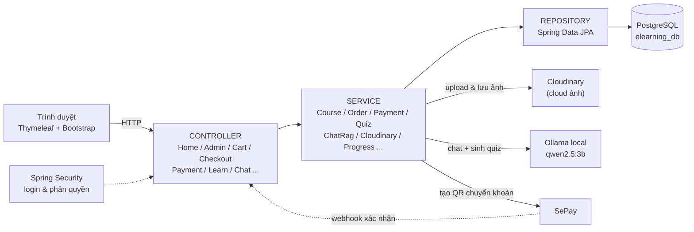
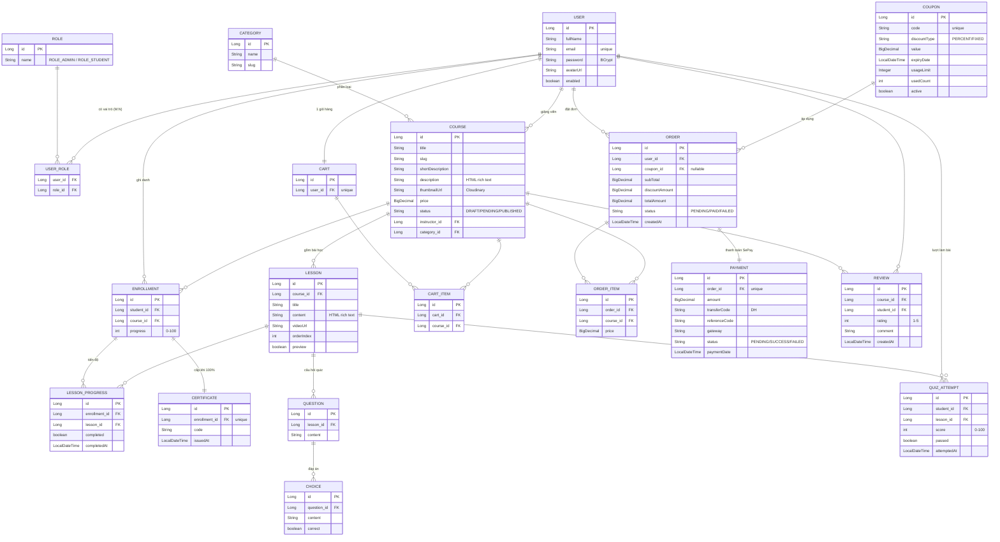
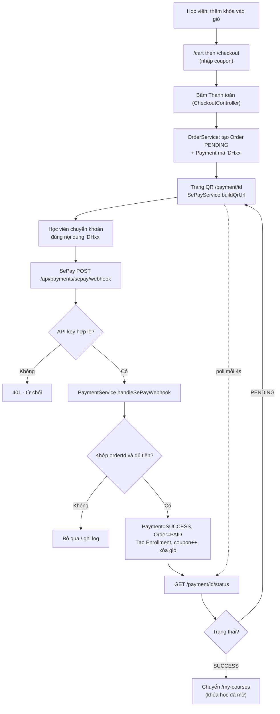
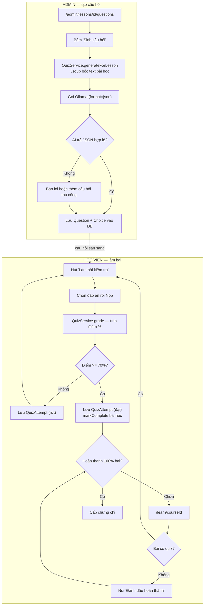
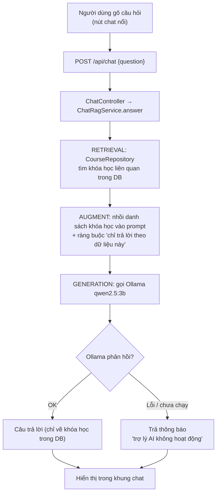

# FPT E-Learning — Nền tảng khóa học online (HSF302)

Đồ án môn **HSF302** — website học trực tuyến xây bằng **Java Spring Boot**, demo đầy đủ:

- **Thanh toán** qua **SePay** (QR chuyển khoản + webhook tự xác nhận)
- **Upload ảnh** và lưu trên **Cloudinary**
- **Rich text editor** (Quill) — chữ đậm/nghiêng/màu/cỡ khác nhau từng đoạn, render lại đúng định dạng
- **Chat AI RAG** (Ollama local) — chỉ trả lời dựa trên dữ liệu khóa học trong DB
- **Bài kiểm tra** trắc nghiệm do **AI tự sinh** từ nội dung bài học, tự chấm điểm
- Giỏ hàng, mã giảm giá, tiến độ học, chứng chỉ, đánh giá

---

## 1. Công nghệ sử dụng

| Thành phần | Công nghệ |
|---|---|
| Ngôn ngữ / Build | Java 21, Maven |
| Framework | Spring Boot **3.5.6** (MVC, Data JPA, Security, Validation) |
| Giao diện | Thymeleaf + Bootstrap 5 + CSS thuần (`static/css/style.css`) |
| Cơ sở dữ liệu | **PostgreSQL** |
| Thanh toán | **SePay** (webhook biến động số dư) |
| Lưu ảnh | **Cloudinary** |
| Rich text | **Quill** → HTML (inline-style) → Jsoup sanitize → `th:utext` |
| AI (chat + sinh quiz) | **Ollama** (model `qwen2.5:3b`) chạy local |

---

## 2. Yêu cầu môi trường (cài trước khi chạy)

| Phần mềm | Phiên bản | Ghi chú |
|---|---|---|
| **JDK** | 21 trở lên | Đã test trên JDK 25. Nhớ đặt `JAVA_HOME`. |
| **PostgreSQL** | 14+ | Tạo user/mật khẩu (mặc định dự án: `postgres` / `12345`). |
| **Ollama** | mới nhất | Để chạy chat AI + sinh câu hỏi. Tải tại https://ollama.com |
| **IDE** | IntelliJ IDEA / Spring Tool Suite / Eclipse | Có Maven tích hợp sẵn (không cần cài Maven riêng). |
| **(tùy chọn) ngrok** | — | Chỉ cần khi test **webhook SePay** trên máy local. |

>  **Encoding**: dự án dùng tiếng Việt UTF-8. Trong IDE hãy đặt **File Encoding = UTF-8** (IntelliJ: Settings → Editor → File Encodings → chọn UTF-8 cho cả 3 mục) để tránh lỗi chữ kiểu `Khóa há»c`.

---

## 3. Cài đặt từng bước

### Bước 1 — Lấy source code
```bash
git clone <link-repo>
cd HSF302_Project
```

### Bước 2 — Tạo database PostgreSQL
Mở **pgAdmin** hoặc `psql`, tạo database:
```sql
CREATE DATABASE elearning_db;
```
> Không cần tạo bảng — Spring tự sinh bảng nhờ `spring.jpa.hibernate.ddl-auto=update`.
> Nếu user/mật khẩu Postgres của bạn khác `postgres/12345`, sửa lại trong file local ở Bước 6.

### Bước 3 — Cài Ollama và tải model AI
```bash
# 1. Tải & cài Ollama từ https://ollama.com  (Windows/Mac/Linux)

# 2. Tải model (chỉ cần làm 1 lần, ~2GB)
ollama pull qwen2.5:3b

# 3. Kiểm tra model đã có
ollama list
```

**Nếu máy bị lỗi GPU/CUDA** (`CUDA error: device kernel image is invalid`) → ép chạy CPU (PowerShell):
```powershell
Get-Process ollama, "ollama app" -ErrorAction SilentlyContinue | Stop-Process -Force
$env:CUDA_VISIBLE_DEVICES = "-1"
$env:OLLAMA_LLM_LIBRARY  = "cpu"
& "$env:LOCALAPPDATA\Programs\Ollama\ollama.exe" serve   # giữ cửa sổ này mở
```
Kiểm tra Ollama sống: mở terminal khác chạy `ollama run qwen2.5:3b "Xin chao"` (in ra câu trả lời là OK).

> ⚠️ **Ollama phải đang chạy** mỗi khi dùng **chat AI** và **sinh câu hỏi quiz**. Nếu chạy CPU mode thủ công thì **giữ cửa sổ `serve` mở** suốt buổi demo (đóng là tắt server).

**Cố định CPU mode** (khỏi gõ lại mỗi lần — chạy 1 lần rồi đăng xuất/đăng nhập lại Windows):
```powershell
[Environment]::SetEnvironmentVariable("CUDA_VISIBLE_DEVICES","-1","User")
[Environment]::SetEnvironmentVariable("OLLAMA_LLM_LIBRARY","cpu","User")
```

> Dùng model **`qwen2.5:3b`** (~2.5GB RAM) vì nhẹ, hợp máy RAM/VRAM thấp. Máy khỏe (RAM trống ≥6GB) có thể đổi sang `qwen2.5:7b` cho câu hỏi tốt hơn: `ollama pull qwen2.5:7b` rồi sửa `ollama.model` trong `application-local.properties`. **Tránh** các model `-coder` (chỉ giỏi code, tiếng Việt kém).

### Bước 4 — Đăng ký Cloudinary (lưu ảnh)
1. Tạo tài khoản miễn phí: https://cloudinary.com
2. Vào **Dashboard** lấy 3 giá trị: `Cloud name`, `API Key`, `API Secret`.

### Bước 5 — (Tùy chọn) Cấu hình SePay
> Có thể bỏ qua nếu chỉ demo các phần khác. Cần khi test thanh toán thật.

Luồng đúng là: **app local chạy ở `localhost:8080` → mở public tunnel → lấy URL public cấu hình vào SePay webhook**. SePay không gọi được trực tiếp vào `localhost`.

1. Đăng ký https://my.sepay.vn, liên kết tài khoản ngân hàng nhận tiền.
2. Đảm bảo tài khoản ngân hàng/API ngân hàng đã kết nối thành công trên SePay. Khi chuyển khoản test, giao dịch phải xuất hiện trong trang **Giao dịch** của SePay trước.
3. Chạy backend Spring Boot trước:
   ```bash
   mvn spring-boot:run
   ```
   Kiểm tra app mở được ở `http://localhost:8080`.
4. Tạo public URL cho backend local bằng một trong hai cách:
   ```bash
   # Cách 1: localtunnel
   npx localtunnel --port 8080

   # Cách 2: ngrok
   ngrok http 8080
   ```
   Ví dụ localtunnel trả về `https://calm-crabs-relax.loca.lt` thì webhook URL sẽ là:
   ```text
   https://calm-crabs-relax.loca.lt/api/payments/sepay/webhook
   ```
5. Vào **Tích hợp Webhooks → Thêm webhook**:
   - **URL**: `https://<domain-public>/api/payments/sepay/webhook`
   - **API Key**: đặt đúng chuỗi bí mật, ví dụ `sepay_key_hsf302_project_2026`
   - Bật **Dùng để xác thực thanh toán**.
   - Có thể bật **Chỉ gửi khi có mã thanh toán** nếu đã cấu hình nhận diện mã thanh toán đúng ở bước 6.
6. Vào **Cấu hình công ty → Cấu hình chung → Nhận diện mã thanh toán**:
   - Bật **Nhận diện mã thanh toán**.
   - Tiền tố: `DH`
   - Hậu tố: từ `1` đến `10` ký tự, kiểu **Số nguyên**.
   - Lưu ý: app sinh mã dạng `DH7`, `DH15`, không phải `DH007`. Nếu đặt hậu tố tối thiểu 3 ký tự thì `DH7` sẽ không được nhận diện.
7. Mỗi lần restart localtunnel/ngrok, public URL có thể đổi. Khi URL đổi phải cập nhật lại webhook URL trên SePay.

### Bước 6 — Tạo file cấu hình bí mật `application-local.properties`
Tạo file **ở thư mục gốc dự án** (cùng cấp `pom.xml`). File này **đã được `.gitignore`** — không bị đẩy lên git.

```properties
# ----- Cloudinary -----
cloudinary.cloud-name=ten_cloud_cua_ban
cloudinary.api-key=123456789
cloudinary.api-secret=abcXyz_secret

# ----- SePay (nếu dùng) -----
sepay.webhook-api-key=sepay_key_hsf302_project_2026
sepay.account-number=0968097907
sepay.account-name=NGO HOANG TRUONG DAT
sepay.bank=MBBank
sepay.prefix=DH

# ----- PostgreSQL (sửa nếu khác mặc định) -----
spring.datasource.username=postgres
spring.datasource.password=12345
```
> App tự nạp file này qua `spring.config.import=optional:file:./application-local.properties` và **ghi đè** các giá trị trong `application.properties`.

---

## 4. Chạy ứng dụng

**Cách 1 — Bằng IDE (khuyên dùng):** mở thư mục dự án → để IDE import Maven → chạy class `ElearningApplication`.

**Cách 2 — Dòng lệnh (nếu đã cài Maven):**
```bash
mvn spring-boot:run
```

Mở trình duyệt: **http://localhost:8080**

### Tài khoản có sẵn (seed tự tạo lần chạy đầu)
| Vai trò | Email | Mật khẩu |
|---|---|---|
| Admin | `admin@fpt.edu.vn` | `123456` |
| Học viên | `student@fpt.edu.vn` | `123456` |

Dữ liệu mẫu: 2 khóa học (Spring Boot, Figma), mã giảm giá **`WELCOME10`** (giảm 10%).

---

## 5. Cấu trúc thư mục

```
HSF302_Project/
├── pom.xml                          # khai báo thư viện (Spring Boot, Cloudinary, Jsoup; Quill nạp qua CDN)
├── application-local.properties     # secret (KHÔNG commit - tự tạo)
├── src/main/
│   ├── java/com/fpt/elearning/
│   │   ├── ElearningApplication.java        # điểm khởi động
│   │   ├── config/                          # cấu hình
│   │   │   ├── SecurityConfig.java          #   phân quyền, login/logout
│   │   │   ├── CloudinaryConfig.java        #   bean Cloudinary
│   │   │   ├── SePayProperties.java         #   đọc cấu hình sepay.*
│   │   │   └── DataInitializer.java         #   seed dữ liệu mẫu
│   │   ├── controller/                      # tầng điều khiển (nhận request)
│   │   │   ├── HomeController.java           #   trang chủ, danh sách, chi tiết khóa học
│   │   │   ├── AuthController.java           #   đăng ký
│   │   │   ├── AdminController.java          #   CRUD khóa học, bài học, danh mục, coupon
│   │   │   ├── AdminQuizController.java      #   quản lý câu hỏi (sinh AI / thêm tay)
│   │   │   ├── CartController.java           #   giỏ hàng
│   │   │   ├── CheckoutController.java       #   thanh toán -> tạo Order
│   │   │   ├── PaymentController.java        #   trang QR + poll trạng thái
│   │   │   ├── SePayWebhookController.java   #   nhận webhook SePay
│   │   │   ├── LearnController.java          #   học bài, làm quiz, chứng chỉ
│   │   │   ├── ReviewController.java         #   đánh giá
│   │   │   └── ChatController.java           #   API chat AI (/api/chat)
│   │   ├── service/                         # tầng nghiệp vụ (xử lý logic)
│   │   │   ├── CourseService, CartService, CouponService, OrderService,
│   │   │   ├── PaymentService, SePayService, CloudinaryService,
│   │   │   ├── ProgressService, CertificateService, QuizService,
│   │   │   ├── ReviewService, ChatRagService (RAG + gọi Ollama),
│   │   │   └── AuthHelper, CustomUserDetailsService
│   │   ├── repository/                      # tầng truy cập DB (Spring Data JPA)
│   │   ├── entity/                          # các bảng (Course, Lesson, Order, Payment,
│   │   │   │                                #   Question, Choice, QuizAttempt, ...)
│   │   │   └── enums/                        # CourseStatus, OrderStatus, PaymentStatus, DiscountType
│   │   ├── dto/                             # CourseForm, ChatRequest/Response, SePayWebhookPayload
│   │   └── util/                            # SlugUtil, HtmlSanitizer (Jsoup)
│   └── resources/
│       ├── application.properties           # cấu hình chung
│       ├── static/css/style.css             # toàn bộ giao diện
│       └── templates/                       # giao diện Thymeleaf
│           ├── fragments/layout.html         #   header + chat widget (dùng chung)
│           ├── home.html, course/*, auth/*
│           ├── admin/*  (dashboard, courses, course-form, lessons, questions, categories, coupons)
│           ├── learn/*  (my-courses, course, quiz, certificate)
│           ├── cart.html, checkout.html, payment/qr.html
```

**Kiến trúc 3 lớp:** `Controller` (nhận request, trả view) → `Service` (logic) → `Repository` (DB). Entity là bảng dữ liệu, DTO là gói dữ liệu truyền giữa các lớp.

---

## Kiến trúc tổng thể



Luồng chuẩn: **Trình duyệt → Controller → Service → Repository → PostgreSQL**. Các dịch vụ ngoài (Cloudinary, Ollama, SePay) được gọi từ tầng Service; riêng SePay gọi ngược lại vào Controller qua webhook.

---

## Sơ đồ ERD (quan hệ dữ liệu)

> Xem trực quan trên GitHub (tự render Mermaid). Nếu xem trong IDE chưa render, cài plugin Mermaid hoặc dán vào https://mermaid.live



**Ghi chú quan hệ:**
- `USER ↔ ROLE`: nhiều-nhiều (bảng trung gian `users_roles`).
- `ENROLLMENT`: bảng nối `USER` và `COURSE` (1 học viên học nhiều khóa, 1 khóa có nhiều học viên).
- `PAYMENT` gắn **1-1** với `ORDER`; `CERTIFICATE` gắn **1-1** với `ENROLLMENT`.
- `QUESTION`/`CHOICE`/`QUIZ_ATTEMPT` thuộc về `LESSON` (mỗi bài học có bộ quiz riêng).

---

## 6. Mô tả các luồng chính

### 6.1. Đăng ký / Đăng nhập
```
/register (AuthController) → mã hóa mật khẩu BCrypt → lưu User (ROLE_STUDENT)
/login    (SecurityConfig) → CustomUserDetailsService nạp user theo email → tạo session
```
Phân quyền: `/admin/**` chỉ `ROLE_ADMIN`; `/cart,/checkout,/learn,/my-courses` cần đăng nhập; còn lại công khai.

### 6.2. Admin tạo khóa học (Rich text + Cloudinary)
```
/admin/courses/new (course-form.html)
  → Quill: gõ mô tả có đậm/nghiêng/màu/cỡ chữ (sinh HTML inline-style)
  → submit -> AdminController -> CourseService.create()
       • upload ảnh thumbnail -> CloudinaryService -> trả secure_url -> lưu DB
       • HtmlSanitizer.clean() lọc HTML (giữ style/màu, chống XSS) -> lưu cột description
  → render lại bằng th:utext (course/detail.html) -> hiển thị ĐÚNG định dạng
```
Sau đó thêm **bài học** (`/admin/courses/{id}/lessons`) — nội dung cũng dùng Quill.

### 6.3. Mua khóa học (Giỏ hàng → Coupon → SePay → Webhook)
```
Thêm vào giỏ (CartController) → /cart → /checkout
  → nhập coupon (CouponService tính giảm giá)
  → "Thanh toán" (CheckoutController) -> OrderService tạo Order(PENDING) + Payment(mã "DH<id>")
  → chuyển sang /payment/{orderId}: hiện QR (SePayService.buildQrUrl) + poll trạng thái mỗi 4s
Người dùng chuyển khoản đúng nội dung "DH<id>"
  → SePay POST /api/payments/sepay/webhook  (kèm header Authorization: Apikey <key>)
  → SePayWebhookController kiểm tra API key
  → PaymentService.handleSePayWebhook(): khớp orderId + số tiền
       • Payment=SUCCESS, Order=PAID
       • tạo Enrollment cho từng khóa -> mở khóa học
       • tăng usedCount của coupon, xóa giỏ hàng
  → trang QR thấy SUCCESS -> tự chuyển /my-courses
```

**Sơ đồ luồng thanh toán SePay:**


### 6.4. Học bài → Quiz (AI sinh) → Chứng chỉ
```
ADMIN: /admin/lessons/{id}/questions
  → (tùy chọn) nhập "Yêu cầu thêm" — chỉ điều chỉnh trong phạm vi bài học, ngoài bài sẽ bị bỏ qua
  → "Sinh câu hỏi" -> QuizService.generateForLesson():
     Jsoup bóc text bài học -> gọi Ollama (format = JSON Schema, ép đúng cấu trúc)
     -> validate (loại đáp án rỗng/nhãn A,B,C,D) + thử lại tối đa 3 lần + làm sạch LaTeX
     -> lưu Question + Choice
  (hoặc "Thêm câu hỏi thủ công" nếu Ollama lỗi)

HỌC VIÊN: /learn/{courseId}
  → bài CÓ quiz: nút "Làm bài kiểm tra" -> /learn/.../quiz -> nộp
     -> QuizService.grade(): chấm %, lưu QuizAttempt
        • đạt >= 70% (quiz.pass-score) -> ProgressService.markComplete() đánh dấu hoàn thành
        • chưa đạt -> làm lại
  → bài KHÔNG quiz: nút "Đánh dấu hoàn thành"
  → đủ 100% bài -> CertificateService cấp chứng chỉ (/certificate/{id})
```

**Sơ đồ luồng bài kiểm tra (Quiz):**


### 6.5. Chat AI RAG (chỉ dùng dữ liệu trong DB)
```
Nút chat nổi (fragments/layout.html) -> POST /api/chat {question}
  → ChatController -> ChatRagService.answer():
     1. RETRIEVAL: CourseRepository lấy khóa học liên quan từ DB
     2. AUGMENT : nhồi danh sách khóa học vào prompt + ràng buộc "chỉ trả lời theo dữ liệu này"
     3. GENERATION: gọi Ollama (qwen2.5:3b) -> trả lời
  → hiển thị trong khung chat
```

---

**Sơ đồ luồng chat AI RAG:**


---

## 7. Bảng cấu hình (`application.properties`)

| Khóa | Ý nghĩa |
|---|---|
| `spring.datasource.*` | Kết nối PostgreSQL (`elearning_db`, cổng 5432) |
| `cloudinary.*` | Thông tin Cloudinary (điền ở `application-local.properties`) |
| `sepay.webhook-api-key` | Key xác thực webhook (phải trùng cấu hình trên SePay) |
| `sepay.account-number/name/bank` | Tài khoản nhận tiền, dùng tạo QR |
| `ollama.url` | `http://localhost:11434` |
| `ollama.model` | `qwen2.5:3b` |
| `quiz.pass-score` | Điểm đạt tối thiểu để qua bài (mặc định 70) |
| `quiz.num-questions` | Số câu AI sinh mỗi bài (mặc định 5) |

---

## 8. Xử lý sự cố thường gặp

| Lỗi | Nguyên nhân & cách xử lý |
|---|---|
| App không khởi động, lỗi kết nối DB | Chưa bật PostgreSQL / sai user-mật khẩu → sửa `application-local.properties` |
| Chat trả "trợ lý AI không hoạt động" | Ollama chưa chạy → bật `ollama serve`; lỗi CUDA → chạy CPU mode (Bước 3) |
| Sinh quiz báo lỗi AI | Ollama chưa chạy hoặc model chậm → đợi / thử lại / thêm câu hỏi thủ công |
| SePay có giao dịch nhưng web vẫn `PENDING` | Kiểm tra webhook URL có đang trỏ đúng public tunnel hiện tại không; public URL đổi thì phải cập nhật lại trên SePay |
| Webhook SePay không về | `localhost` không nhận được webhook → dùng **localtunnel/ngrok**; kiểm tra API key trùng nhau |
| SePay có giao dịch nhưng không thấy mã thanh toán | Kiểm tra **Cấu hình công ty → Nhận diện mã thanh toán**: tiền tố `DH`, hậu tố từ `1` đến `10` ký tự số |
| QR quét được nhưng nội dung chuyển khoản sai | Kiểm tra QR phải hiện đúng số tiền và nội dung `DH<orderId>`; nếu cần thì dùng nút Copy nội dung trên trang thanh toán |
| Giao diện chưa cập nhật | Cache trình duyệt → **Ctrl + F5** |
| Editor (Quill) không hiện | Mất mạng (Quill tải qua CDN jsDelivr) → cần có mạng để tải editor |
| Chữ tiếng Việt bị lỗi `ó` | Đặt **File Encoding = UTF-8** trong IDE rồi mở lại file |

---

## 9. Quy ước làm việc nhóm (gợi ý)

- **Không commit** `application-local.properties` (đã có trong `.gitignore`) — mỗi người tự tạo file của mình.
- Mỗi tính năng làm trên 1 nhánh riêng: `git checkout -b feature/ten-tinh-nang`, xong tạo Pull Request.
- Đặt tên class theo lớp: `*Controller`, `*Service`, `*Repository`, `*Entity`.

---

> Đồ án môn HSF302 — FPT University.
